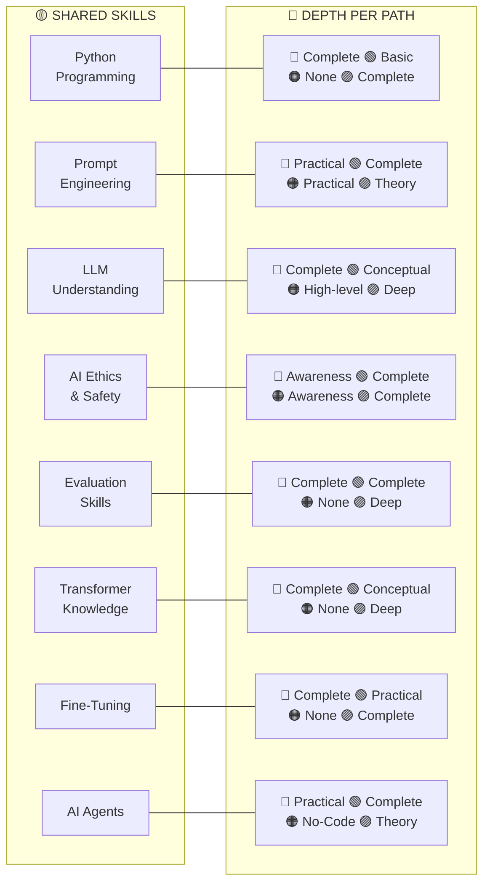

# 🏰 THE AI KINGDOM — Complete Mermaid Diagram

> **4 Paths** (breadth) × **Deep Levels** (depth) × **Skills → Job Roles**
> Legend: 📖 Theory Only | 🔧 Practical Only | 📚 Complete (Theory + Practical) | ❌ Not Needed

---

## 1. The Grand Overview — 4 Paths & Their Pillars

```mermaid
flowchart TD
    AIK["🏰 THE AI KINGDOM\nMaster the breadth and depth of AI"]

    AIK --> MLE["🔵 PATH 1: ML ENGINEER\n📚 Build & train models from scratch\nNeeds: Complete knowledge"]
    AIK --> AIAD["🟢 PATH 2: AI APP DEVELOPER\n🔧 Build production AI apps with LLMs\nNeeds: Practical + some theory"]
    AIK --> AIPU["🟠 PATH 3: AI POWER USER\n🔧 Use AI tools to 10x productivity\nNeeds: Practical + awareness"]
    AIK --> AIR["🟣 PATH 4: AI RESEARCHER\n📚 Advance the frontier of AI\nNeeds: Deep complete knowledge"]

    MLE --> MLE1["Phase 1\nPython & Computation\n📚 Complete"]
    MLE --> MLE2["Phase 2\nMathematics\n📚 Complete"]
    MLE --> MLE3["Phase 3\nCore Machine Learning\n📚 Complete"]
    MLE --> MLE4["Phase 4\nDeep Learning\n📚 Complete"]
    MLE --> MLE5["Phase 5\nSpecialization Tracks\n🔧 Practical"]
    MLE --> MLE6["Phase 6\nCutting-Edge AI\n📚 Complete"]
    MLE --> MLE7["Phase 7\nMLOps & Career\n🔧 Practical"]

    AIAD --> AD1["Phase 1\nLLM Foundations & APIs\n📖 + 🔧"]
    AIAD --> AD2["Phase 2\nEvaluation & Benchmarks\n📚 Complete"]
    AIAD --> AD3["Phase 3\nRAG Systems\n🔧 Practical"]
    AIAD --> AD4["Phase 4\nAI Agents & Tool Use\n🔧 Practical"]
    AIAD --> AD5["Phase 5\nSafety & Reliability\n📚 Complete"]
    AIAD --> AD6["Phase 6\nFine-Tuning\n🔧 Practical"]
    AIAD --> AD7["Phase 7\nProduction Engineering\n🔧 Practical"]
    AIAD --> AD8["Phase 8\nLLM Inference Mastery\n📖 + 🔧"]

    AIPU --> PU1["Sec 1\nUnderstanding AI\n📖 Theory"]
    AIPU --> PU2["Sec 2\nPrompt Engineering\n🔧 Practical"]
    AIPU --> PU3["Sec 3\nAI Tools Landscape\n🔧 Practical"]
    AIPU --> PU4["Sec 4\nWorkflow Automation\n🔧 Practical"]
    AIPU --> PU5["Sec 5\nEthics & Safety\n📖 Theory"]
    AIPU --> PU6["Sec 6\nDomain-Specific AI\n🔧 Practical"]
    AIPU --> PU7["Sec 7\nStaying Current\n🔧 Practical"]

    AIR --> AR1["Foundation\nDeep Mathematics\n📚 Complete"]
    AIR --> AR2["Core\nML Theory Deep\n📚 Complete"]
    AIR --> AR3["Core\nDL Theory Deep\n📚 Complete"]
    AIR --> AR4["Specialization\nResearch Tracks\n📚 Complete"]
    AIR --> AR5["Frontier\nLLMs & Generative AI\n📚 Complete"]
    AIR --> AR6["Frontier\nCutting-Edge Research\n📖 + 🔧"]
    AIR --> AR7["Meta\nResearch Methodology\n📚 Complete"]
```

---

## 2. 🔵 ML Engineer — Deep Dive (Levels 2 → 3 → 4)

> ML Engineers need **complete knowledge** (theory + practice) across all phases. Most mathematically rigorous path.

```mermaid
flowchart TD
    MLE["🔵 ML ENGINEER PATH\n📚 Complete Knowledge Required"]

    MLE --> P1["Phase 1: Python & Computation"]
    MLE --> P2["Phase 2: Mathematics"]
    MLE --> P3["Phase 3: Core ML"]
    MLE --> P4["Phase 4: Deep Learning"]
    MLE --> P5["Phase 5: Specializations"]
    MLE --> P6["Phase 6: Cutting-Edge AI"]
    MLE --> P7["Phase 7: MLOps & Career"]

    P1 --> P1A["Core Python 📚\nVariables, Control Flow,\nOOP, Generators, Decorators"]
    P1 --> P1B["Data Science Libraries 📚\nNumPy, Pandas, Matplotlib,\nSeaborn, Plotly"]
    P1 --> P1C["Software Engineering 🔧\nTesting, Git, Packaging,\nVirtual Envs, CI basics"]
    P1A --> P1A1["✅ Skill: Python Fluency\nWrite production-grade Python"]
    P1B --> P1B1["✅ Skill: Data Manipulation\nClean, transform, visualize data"]
    P1C --> P1C1["✅ Skill: Code Quality\nTestable, maintainable code"]

    P2 --> P2A["Linear Algebra 📚\nVectors, Matrices, Eigenvalues,\nSVD, PCA derivation"]
    P2 --> P2B["Calculus 📚\nDerivatives, Gradients,\nChain Rule, Optimization"]
    P2 --> P2C["Probability & Statistics 📚\nDistributions, Bayes Theorem,\nHypothesis Testing, MLE/MAP"]
    P2A --> P2A1["✅ Skill: Math for ML\nUnderstand model internals"]
    P2B --> P2B1["✅ Skill: Optimization Intuition\nGradient descent, loss landscapes"]
    P2C --> P2C1["✅ Skill: Statistical Reasoning\nDesign experiments, interpret results"]

    P3 --> P3A["Supervised Learning 📚\nLinear/Logistic Regression, SVM,\nDecision Trees, Random Forest,\nXGBoost, KNN, Naive Bayes"]
    P3 --> P3B["Unsupervised Learning 📚\nK-Means, DBSCAN, PCA,\nt-SNE, UMAP, GMMs"]
    P3 --> P3C["Feature Engineering 🔧\nEncoding, Scaling, Selection,\nImputation, Pipelines"]
    P3 --> P3D["Model Evaluation 📚\nCross-Validation, Metrics,\nBias-Variance, Hyperparameter\nTuning, Ensemble Methods"]
    P3A --> P3A1["✅ Skill: Algorithm Selection\nChoose right model for the task"]
    P3B --> P3B1["✅ Skill: Pattern Discovery\nFind hidden structures in data"]
    P3D --> P3D1["✅ Skill: Model Validation\nRigorous evaluation practices"]

    P4 --> P4A["Neural Networks 📚\nPerceptrons, Backpropagation,\nActivation Fns, Loss Fns"]
    P4 --> P4B["CNNs 📚\nConvolution, Pooling,\nResNet, VGG, Transfer Learning"]
    P4 --> P4C["RNNs & Sequence 📚\nLSTM, GRU, Seq2Seq,\nBidirectional, Attention"]
    P4 --> P4D["Transformers 📚\nSelf-Attention, Multi-Head,\nEncoder-Decoder, BERT, GPT"]
    P4 --> P4E["Frameworks 🔧\nPyTorch, TensorFlow,\nHugging Face Transformers"]
    P4A --> P4A1["✅ Skill: Network Design\nArchitect neural networks"]
    P4D --> P4D1["✅ Skill: Transformer Mastery\nFoundation of modern AI"]
    P4E --> P4E1["✅ Skill: Framework Fluency\nImplement & train models"]

    P5 --> P5A["NLP 🔧\nTokenization, Embeddings,\nNER, Sentiment, Translation"]
    P5 --> P5B["Computer Vision 🔧\nClassification, Detection,\nSegmentation, GANs, Diffusion"]
    P5 --> P5C["Reinforcement Learning 🔧\nMDPs, Q-Learning, Policy\nGradient, PPO, RLHF"]
    P5 --> P5D["Other Tracks 🔧\nTime Series, Recommender\nSystems, Graph NNs"]
    P5A --> P5A1["✅ Skill: NLP Pipeline\nEnd-to-end text ML systems"]
    P5B --> P5B1["✅ Skill: Vision Pipeline\nEnd-to-end image/video ML"]
    P5C --> P5C1["✅ Skill: RL Systems\nAgent training & environments"]

    P6 --> P6A["LLMs 📚\nArchitecture, Training,\nScaling Laws, Emergent Capabilities"]
    P6 --> P6B["Fine-Tuning & Alignment 📚\nSFT, RLHF, DPO,\nLoRA, QLoRA, PEFT"]
    P6 --> P6C["AI Agents 🔧\nTool Use, ReAct,\nPlanning, Multi-Agent"]
    P6 --> P6D["Multimodal AI 📚\nVision-Language, Audio,\nCLIP, Stable Diffusion"]

    P7 --> P7A["Model Serving 🔧\nAPIs, Containers, TorchServe,\nTFServing, Triton"]
    P7 --> P7B["MLOps 🔧\nMLflow, W&B, DVC,\nCI/CD for ML, Monitoring"]
    P7 --> P7C["Cloud & Compute 🔧\nAWS, GCP, Azure,\nGPU management"]
    P7 --> P7D["Kaggle & Portfolio 🔧\nCompetitions, Papers,\nOpen Source contributions"]
```

---

## 3. 🟢 AI Application Developer — Deep Dive (Levels 2 → 3 → 4)

> App Developers need **practical knowledge** primarily, with **conceptual theory** for LLM internals. No need to train models from scratch.

```mermaid
flowchart TD
    AD["🟢 AI APP DEVELOPER PATH\n🔧 Practical Focus + Conceptual Theory"]

    AD --> A1["Phase 1: LLM Foundations & APIs"]
    AD --> A2["Phase 2: Evaluation & Benchmarks"]
    AD --> A3["Phase 3: RAG Systems"]
    AD --> A4["Phase 4: Agents & Tool Use"]
    AD --> A5["Phase 5: Safety & Reliability"]
    AD --> A6["Phase 6: Fine-Tuning"]
    AD --> A7["Phase 7: Production Engineering"]
    AD --> A8["Phase 8: Inference Mastery"]

    A1 --> A1A["Transformer Architecture 📖\nConceptual only: Tokens,\nAttention, Context windows"]
    A1 --> A1B["LLM APIs 🔧\nOpenAI, Anthropic Claude,\nGemini, Ollama, LiteLLM"]
    A1 --> A1C["Prompt Engineering 📚\nZero/Few-shot, CoT, ReAct,\nTree of Thoughts, DSPy"]
    A1A --> A1A1["✅ Skill: LLM Intuition\nKnow what models can/can't do"]
    A1B --> A1B1["✅ Skill: API Fluency\nCall any LLM provider's API"]
    A1C --> A1C1["✅ Skill: Prompt Craft\nEngineer reliable prompts"]

    A2 --> A2A["Standard Benchmarks 📖\nMMLU, HellaSwag, GSM8K,\nHumanEval, MT-Bench"]
    A2 --> A2B["Custom Evals 🔧\nLLM-as-Judge, Human Eval,\nA/B Testing, Eval Datasets"]
    A2A --> A2A1["✅ Skill: Model Selection\nChoose the right model"]
    A2B --> A2B1["✅ Skill: Quality Measurement\nMeasure & improve AI outputs"]

    A3 --> A3A["Vector Databases 🔧\nPinecone, Weaviate, Chroma,\npgvector, Qdrant"]
    A3 --> A3B["Embeddings 📖+🔧\nEmbedding Models, Dimensions,\nSimilarity Search"]
    A3 --> A3C["RAG Pipeline 🔧\nChunking, Retrieval,\nReranking, Hybrid Search"]
    A3 --> A3D["Advanced RAG 🔧\nMulti-hop, Self-RAG,\nRAPTOR, Graph RAG"]
    A3C --> A3C1["✅ Skill: Knowledge Systems\nGround LLMs in real data"]
    A3D --> A3D1["✅ Skill: Advanced Retrieval\nHandle complex knowledge tasks"]

    A4 --> A4A["Agent Foundations 📚\nReAct, Plan-Execute,\nReflection, Tool Selection"]
    A4 --> A4B["Frameworks 🔧\nLangChain, LlamaIndex,\nCrewAI, AutoGen, Claude SDK"]
    A4 --> A4C["Multi-Agent Systems 🔧\nOrchestration, Communication,\nTask Decomposition"]
    A4 --> A4D["Tool Integration 🔧\nFunction Calling, MCP,\nCode Execution, Web Browse"]
    A4A --> A4A1["✅ Skill: Agent Architecture\nDesign autonomous AI systems"]
    A4B --> A4B1["✅ Skill: Framework Mastery\nBuild agents with any framework"]

    A5 --> A5A["Content Safety 📚\nPrompt Injection Defense,\nJailbreak Prevention, Filtering"]
    A5 --> A5B["Structured Outputs 🔧\nJSON Schema, Pydantic,\nInstructor, Outlines, Guardrails"]
    A5A --> A5A1["✅ Skill: AI Safety\nBuild safe, reliable AI apps"]

    A6 --> A6A["When to Fine-tune 📖\nvs Prompt Engineering\nvs RAG — Decision Framework"]
    A6 --> A6B["PEFT Methods 🔧\nLoRA, QLoRA,\nAdapters, Prefix Tuning"]
    A6 --> A6C["Training Pipeline 🔧\nDataset Curation, HF Trainer,\nAxolotl, Unsloth"]
    A6B --> A6B1["✅ Skill: Model Customization\nAdapt models to specific tasks"]

    A7 --> A7A["AI-Powered APIs 🔧\nFastAPI, Streaming,\nWebSockets, Auth, Rate Limits"]
    A7 --> A7B["Deployment 🔧\nDocker, Kubernetes,\nServerless, Edge"]
    A7 --> A7C["Observability 🔧\nLangSmith, LangFuse,\nPhoenix, Cost & Latency"]
    A7A --> A7A1["✅ Skill: AI API Design\nProduction-grade AI services"]
    A7C --> A7C1["✅ Skill: AI Ops\nMonitor & optimize AI systems"]

    A8 --> A8A["Decoding Algorithms 📖+🔧\nGreedy, Beam Search,\nSpeculative, Sampling"]
    A8 --> A8B["Efficient Inference 📖+🔧\nKV Cache, Quantization,\nFlash Attention, Pruning"]
    A8 --> A8C["Serving Systems 🔧\nvLLM, TGI, TensorRT-LLM,\nOllama at Scale"]
    A8B --> A8B1["✅ Skill: Inference Optimization\nFast, cheap LLM serving"]
```

---

## 4. 🟠 AI Power User — Deep Dive (Levels 2 → 3 → 4)

> Power Users need **practical tool skills** and **conceptual awareness**. No coding required. Focus is on leveraging AI for domain-specific productivity.

```mermaid
flowchart TD
    PU["🟠 AI POWER USER PATH\n🔧 Practical + 📖 Awareness"]

    PU --> S1["Sec 1: Understanding AI"]
    PU --> S2["Sec 2: Prompt Engineering"]
    PU --> S3["Sec 3: AI Tools Landscape"]
    PU --> S4["Sec 4: Workflow Automation"]
    PU --> S5["Sec 5: Ethics & Safety"]
    PU --> S6["Sec 6: Domain-Specific AI"]
    PU --> S7["Sec 7: Staying Current"]

    S1 --> S1A["What AI Is 📖\nAI vs ML vs DL, LLMs,\nTraining vs Inference"]
    S1 --> S1B["AI Landscape 📖\nProviders, Models,\nOpen vs Closed source"]
    S1 --> S1C["Capabilities & Limits 📖\nHallucinations, Biases,\nWhen NOT to use AI"]
    S1A --> S1A1["✅ Skill: AI Literacy\nExplain AI to anyone"]
    S1C --> S1C1["✅ Skill: Critical AI Thinking\nKnow when to trust AI"]

    S2 --> S2A["Prompt Fundamentals 🔧\nRole + Task + Format +\nConstraints + Context"]
    S2 --> S2B["Intermediate Techniques 🔧\nChain-of-Thought, Role,\nComparison, Reverse Prompting"]
    S2 --> S2C["Advanced Techniques 🔧\nSystem Prompts, Chaining,\nTemplates, Custom Assistants"]
    S2 --> S2D["Image Prompting 🔧\nStyle, Composition, Negative\nPrompts, Midjourney params"]
    S2A --> S2A1["✅ Skill: Effective Prompting\nGet quality outputs consistently"]
    S2C --> S2C1["✅ Skill: AI Workflow Design\nChain prompts into pipelines"]

    S3 --> S3A["Text & Chat AI 🔧\nChatGPT, Claude, Gemini,\nPerplexity, Specialized Tools"]
    S3 --> S3B["Image Generation 🔧\nMidjourney, DALL-E, Firefly,\nStable Diffusion, Canva AI"]
    S3 --> S3C["Video Generation 🔧\nSora, Kling, Runway, Pika,\nSynthesia, HeyGen"]
    S3 --> S3D["Audio & Music AI 🔧\nElevenLabs, Suno, Udio,\nAIVA, Descript"]
    S3 --> S3E["Productivity AI 🔧\nNotion AI, Obsidian,\nOtter.ai, Gamma"]
    S3 --> S3F["Design & Business 🔧\nCanva, Figma AI, Framer,\nJasper, Copy.ai, HubSpot AI"]
    S3A --> S3A1["✅ Skill: Tool Selection\nRight AI tool for each task"]
    S3D --> S3D1["✅ Skill: Multimedia AI\nCreate audio/video with AI"]

    S4 --> S4A["Automation Concepts 📖\nTriggers, Actions, Workflows,\nAPIs conceptual"]
    S4 --> S4B["Zapier 🔧\nNo-code automation,\nAI integrations"]
    S4 --> S4C["Make / Integromat 🔧\nVisual workflow builder,\nComplex branching"]
    S4 --> S4D["n8n 🔧\nSelf-hosted, advanced\nAI workflows"]
    S4 --> S4E["No-Code AI Agents 🔧\nCustomGPTs, Claude Projects,\nRelevance AI, Voiceflow"]
    S4B --> S4B1["✅ Skill: AI Automation\nAutomate repetitive tasks"]
    S4E --> S4E1["✅ Skill: Agent Building\nCreate AI assistants — no code"]

    S5 --> S5A["Privacy & Data 📖\nWhat data AI collects,\nConfidential info risks"]
    S5 --> S5B["Copyright & IP 📖\nWho owns AI output,\nFair use, Licensing"]
    S5 --> S5C["Deepfakes & Misinfo 📖\nDetection, Verification,\nResponsible sharing"]
    S5 --> S5D["Responsible AI Use 📖\nBias awareness, Disclosure,\nHuman-in-the-loop"]
    S5A --> S5A1["✅ Skill: AI Safety Awareness\nUse AI responsibly"]

    S6 --> S6A["Music & Audio 🔧\nAI composition, Voice cloning,\nAudio enhancement"]
    S6 --> S6B["Film & Video 🔧\nAI pre-production, VFX,\nEditing, Color grading"]
    S6 --> S6C["Art & Design 🔧\nConcept art, Brand assets,\nUI/UX with AI"]
    S6 --> S6D["Writing & Journalism 🔧\nDrafting, Research, Editing,\nFact-checking with AI"]
    S6 --> S6E["Education 🔧\nAI tutoring, Content creation,\nAssessment, Personalization"]
    S6 --> S6F["Healthcare & Legal 📖\nAwareness of AI applications,\nLimitations, Regulations"]
    S6D --> S6D1["✅ Skill: Domain AI Mastery\nAI-augmented domain expertise"]
```

---

## 5. 🟣 AI Researcher — Deep Dive (Levels 2 → 3 → 4)

> Researchers need the **deepest complete knowledge** — rigorous theory + experimental validation. Shared foundation with ML Engineer but goes far deeper.

```mermaid
flowchart TD
    AR["🟣 AI RESEARCHER PATH\n📚 Deep Complete Knowledge"]

    AR --> R1["Foundation: Deep Mathematics"]
    AR --> R2["Core: ML Theory"]
    AR --> R3["Core: DL Theory"]
    AR --> R4["Specialization: Research Tracks"]
    AR --> R5["Frontier: LLMs & GenAI"]
    AR --> R6["Frontier: Cutting-Edge"]
    AR --> R7["Meta: Research Skills"]

    R1 --> R1A["Linear Algebra 📚\nEigendecomposition, SVD,\nMatrix Calculus, Tensor Algebra"]
    R1 --> R1B["Calculus & Analysis 📚\nMultivariable, Measure Theory,\nFunctional Analysis, Variational"]
    R1 --> R1C["Probability Theory 📚\nMeasure-Theoretic, Stochastic\nProcesses, Information Theory"]
    R1 --> R1D["Optimization 📚\nConvex, Non-convex,\nConstrained, Duality Theory"]
    R1A --> R1A1["✅ Skill: Mathematical Rigor\nProve theorems, derive algorithms"]
    R1D --> R1D1["✅ Skill: Optimization Mastery\nDesign new training algorithms"]

    R2 --> R2A["Statistical Learning Theory 📚\nVC Dimension, PAC Learning,\nRademacher Complexity"]
    R2 --> R2B["Bayesian Methods 📚\nBayesian Inference, MCMC,\nVariational Inference, GPs"]
    R2 --> R2C["Kernel Methods 📚\nKernel Trick, RKHS,\nSVM Theory, Kernel PCA"]
    R2 --> R2D["Graphical Models 📚\nBayesian Networks, MRFs,\nCausal Inference"]
    R2A --> R2A1["✅ Skill: Theoretical Analysis\nBound generalization, prove convergence"]
    R2B --> R2B1["✅ Skill: Probabilistic Modeling\nUncertainty quantification"]

    R3 --> R3A["Optimization Landscape 📚\nLoss Surfaces, Saddle Points,\nAdam/SGD Analysis"]
    R3 --> R3B["Generalization Theory 📚\nDouble Descent, Implicit\nRegularization, Neural Tangent Kernels"]
    R3 --> R3C["Architecture Theory 📚\nUniversal Approximation,\nDepth vs Width, Skip Connections"]
    R3 --> R3D["Representation Learning 📚\nDisentanglement, Information\nBottleneck, Contrastive Learning"]
    R3A --> R3A1["✅ Skill: Training Insight\nUnderstand why networks learn"]
    R3B --> R3B1["✅ Skill: Generalization Understanding\nWhy models generalize"]

    R4 --> R4A["NLP Research 📚\nComputational Linguistics,\nFormal Grammars, Discourse"]
    R4 --> R4B["CV Research 📚\nGeometric DL, 3D Vision,\nNeRF, Scene Understanding"]
    R4 --> R4C["RL Research 📚\nMDP Theory, Model-Based RL,\nOffline RL, Multi-Agent, RLHF"]
    R4 --> R4D["Graph NNs 📚\nMessage Passing, Spectral\nMethods, Geometric DL"]
    R4A --> R4A1["✅ Skill: Research Depth\nPublish in top venues"]
    R4C --> R4C1["✅ Skill: RL Theory\nDesign learning algorithms"]

    R5 --> R5A["LLM Architecture 📚\nScaling Laws, Emergent Abilities,\nMechanistic Interpretability"]
    R5 --> R5B["Training at Scale 📚\nDistributed Training, FSDP,\nDeepSpeed, Megatron-LM"]
    R5 --> R5C["Alignment Research 📚\nRLHF Theory, Constitutional AI,\nDPO, KTO, Scalable Oversight"]
    R5 --> R5D["Generative Models 📚\nVAEs, GANs, Normalizing Flows,\nDiffusion Models Theory"]
    R5A --> R5A1["✅ Skill: LLM Understanding\nExplain model behavior formally"]
    R5C --> R5C1["✅ Skill: Alignment Science\nMake AI systems safe"]

    R6 --> R6A["AI Safety & Alignment 📖+🔧\nDeceptive Alignment, Interp,\nRed Teaming, Governance"]
    R6 --> R6B["Efficient Architectures 📖+🔧\nMixture of Experts, State Space,\nMamba, RWKV, Linear Attention"]
    R6 --> R6C["Neurosymbolic AI 📖\nNeural + Symbolic Reasoning,\nProgram Synthesis"]
    R6 --> R6D["World Models 📖\nPlanning, Prediction,\nEmbodied AI, Robotics FMs"]
    R6 --> R6E["Multimodal Frontier 📖+🔧\nUnified Architectures,\nAny-to-Any Generation"]
    R6A --> R6A1["✅ Skill: Safety Research\nContribute to AI safety"]
    R6B --> R6B1["✅ Skill: Architecture Innovation\nDesign next-gen models"]

    R7 --> R7A["Paper Reading 📚\narXiv, NeurIPS, ICML,\nICLR, ACL, CVPR"]
    R7 --> R7B["Paper Writing 📚\nLaTeX, Experiment Design,\nReproducibility, Peer Review"]
    R7 --> R7C["Research Tools 🔧\nW&B, Git, HPC Clusters,\nJAX/PyTorch"]
    R7A --> R7A1["✅ Skill: Literature Mastery\nNavigate research landscape"]
    R7B --> R7B1["✅ Skill: Scientific Communication\nWrite & present research"]
```

---

## 6. 🟡 Cross-Path Shared Skills — Depth Required Per Path

---

## 7. 🔴 Skills → Job Roles Mapping

> Each job role is formed by combining specific skills. Color indicates the primary source path.

```mermaid
flowchart TD
    subgraph SKILLS["📦 SKILL POOLS"]
        SK_PY["🔵 Python Fluency"]
        SK_MATH["🔵 Math Mastery"]
        SK_ML["🔵 ML Algorithms"]
        SK_DL["🔵 Deep Learning"]
        SK_NLP["🔵 NLP Specialization"]
        SK_CV["🔵 CV Specialization"]
        SK_RL["🟣 RL Specialization"]
        SK_MLOPS["🔵 MLOps & Deployment"]
        SK_API["🟢 LLM API Fluency"]
        SK_PROMPT["🟢🟠 Prompt Engineering"]
        SK_RAG["🟢 RAG Systems"]
        SK_AGENT["🟢 Agent Architecture"]
        SK_SAFETY["🟢🟣 AI Safety"]
        SK_FINETUNE["🟢🔵 Fine-Tuning"]
        SK_PROD["🟢 Production Engineering"]
        SK_EVAL["🟢🔵 Evaluation"]
        SK_TOOLS["🟠 AI Tool Mastery"]
        SK_AUTO["🟠 Workflow Automation"]
        SK_DOMAIN["🟠 Domain AI Expertise"]
        SK_THEORY["🟣 Theoretical Depth"]
        SK_RESEARCH["🟣 Research Methodology"]
        SK_FRONTIER["🟣 Frontier Knowledge"]
        SK_ALIGN["🟣 Alignment Science"]
        SK_INFER["🟢 Inference Optimization"]
    end

    subgraph ROLES["🎯 JOB ROLES"]
        JR1["🔴 Data Scientist"]
        JR2["🔴 ML Engineer"]
        JR3["🔴 Deep Learning Engineer"]
        JR4["🔴 NLP Engineer"]
        JR5["🔴 Computer Vision Engineer"]
        JR6["🔴 AI Application Developer"]
        JR7["🔴 Full Stack AI Engineer"]
        JR8["🔴 AI Solutions Architect"]
        JR9["🔴 Prompt Engineer"]
        JR10["🔴 MLOps Engineer"]
        JR11["🔴 AI Product Manager"]
        JR12["🔴 AI Researcher"]
        JR13["🔴 AI Safety Researcher"]
        JR14["🔴 AI Consultant"]
        JR15["🔴 AI Content Creator"]
        JR16["🔴 LLM Inference Engineer"]
        JR17["🔴 RL Engineer"]
    end

    SK_PY --> JR1
    SK_MATH --> JR1
    SK_ML --> JR1
    SK_EVAL --> JR1

    SK_PY --> JR2
    SK_MATH --> JR2
    SK_ML --> JR2
    SK_DL --> JR2
    SK_MLOPS --> JR2

    SK_PY --> JR3
    SK_MATH --> JR3
    SK_DL --> JR3
    SK_FINETUNE --> JR3

    SK_DL --> JR4
    SK_NLP --> JR4
    SK_FINETUNE --> JR4

    SK_DL --> JR5
    SK_CV --> JR5

    SK_PY --> JR6
    SK_API --> JR6
    SK_PROMPT --> JR6
    SK_RAG --> JR6
    SK_AGENT --> JR6
    SK_PROD --> JR6

    SK_API --> JR7
    SK_RAG --> JR7
    SK_AGENT --> JR7
    SK_PROD --> JR7
    SK_ML --> JR7

    SK_API --> JR8
    SK_RAG --> JR8
    SK_PROD --> JR8
    SK_ML --> JR8
    SK_MLOPS --> JR8

    SK_PROMPT --> JR9
    SK_EVAL --> JR9
    SK_TOOLS --> JR9

    SK_PY --> JR10
    SK_ML --> JR10
    SK_MLOPS --> JR10
    SK_PROD --> JR10

    SK_TOOLS --> JR11
    SK_EVAL --> JR11
    SK_PROMPT --> JR11
    SK_DOMAIN --> JR11

    SK_MATH --> JR12
    SK_DL --> JR12
    SK_THEORY --> JR12
    SK_RESEARCH --> JR12
    SK_FRONTIER --> JR12

    SK_DL --> JR13
    SK_SAFETY --> JR13
    SK_ALIGN --> JR13
    SK_RESEARCH --> JR13

    SK_TOOLS --> JR14
    SK_PROMPT --> JR14
    SK_DOMAIN --> JR14
    SK_AUTO --> JR14

    SK_TOOLS --> JR15
    SK_PROMPT --> JR15
    SK_DOMAIN --> JR15

    SK_DL --> JR16
    SK_INFER --> JR16
    SK_PROD --> JR16

    SK_MATH --> JR17
    SK_DL --> JR17
    SK_RL --> JR17
    SK_THEORY --> JR17
```

---

## 8. 📈 Learning Path Progression & Convergence

> How the 4 paths share foundations, diverge, and where you can switch between them.

```mermaid
flowchart TD
    START["🏰 START HERE\nChoose Your Path"]

    START --> L1_COMMON["Level 0: Common Foundation\nAI Literacy • Basic Prompting • Ethics Awareness"]

    L1_COMMON --> L1_PU["🟠 Power User Track\nNo coding needed"]
    L1_COMMON --> L1_CODE["Coding Track\nPython required"]

    L1_PU --> L2_PU_TOOLS["Level 1: Master AI Tools\nChatGPT, Claude, Midjourney,\nElevenLabs, Perplexity"]
    L2_PU_TOOLS --> L3_PU_ADV["Level 2: Advanced Usage\nPrompt Chains, Automation,\nZapier, Make, n8n"]
    L3_PU_ADV --> L4_PU_DOMAIN["Level 3: Domain Specialization\nMusic / Film / Art / Writing /\nEducation / Healthcare / Legal"]
    L4_PU_DOMAIN --> PU_ROLES["🔴 Unlock Roles:\nAI Content Creator\nAI Consultant\nAI Product Manager\nPrompt Engineer"]

    L1_CODE --> L2_PYTHON["Level 1: Python Mastery\nCore Python, OOP,\nData Science Libraries"]

    L2_PYTHON --> L2_BRANCH["Choose Specialization"]

    L2_BRANCH --> L3_APP["🟢 App Developer Track"]
    L2_BRANCH --> L3_ML["🔵 ML Engineer Track"]

    L3_APP --> L4_APP_API["Level 2: LLM APIs & Prompts\nOpenAI, Anthropic, Gemini APIs,\nAdvanced Prompt Engineering"]
    L4_APP_API --> L5_APP_BUILD["Level 3: Build AI Systems\nRAG, Agents, Tool Use,\nEvaluation, Safety"]
    L5_APP_BUILD --> L6_APP_PROD["Level 4: Production & Scale\nFastAPI, Docker, Monitoring,\nFine-tuning, Inference Optimization"]
    L6_APP_PROD --> APP_ROLES["🔴 Unlock Roles:\nAI Application Developer\nFull Stack AI Engineer\nAI Solutions Architect\nLLM Inference Engineer"]

    L3_ML --> L4_ML_MATH["Level 2: Mathematics\nLinear Algebra, Calculus,\nProbability & Statistics"]
    L4_ML_MATH --> L5_ML_CORE["Level 3: Core ML & DL\nSupervised/Unsupervised,\nNeural Nets, CNNs, RNNs,\nTransformers"]
    L5_ML_CORE --> L6_ML_SPEC["Level 4: Specialization\nNLP, CV, RL, Time Series,\nRecommender Systems, GNNs"]
    L6_ML_SPEC --> L7_ML_ADV["Level 5: Advanced & MLOps\nLLMs, Fine-tuning, Agents,\nDeployment, Monitoring"]
    L7_ML_ADV --> ML_ROLES["🔴 Unlock Roles:\nData Scientist\nML Engineer\nDL Engineer\nNLP/CV Engineer\nMLOps Engineer"]

    L5_ML_CORE --> L6_RES["🟣 Research Branch\nDeep Theory Fork"]
    L6_RES --> L7_RES_THEORY["Level 4: Deep Theory\nStatistical Learning Theory,\nBayesian Methods, Optimization,\nGeneralization Theory"]
    L7_RES_THEORY --> L8_RES_FRONT["Level 5: Frontier Research\nInterpretability, Alignment,\nEfficient Architectures,\nNeurosymbolic AI, World Models"]
    L8_RES_FRONT --> RES_ROLES["🔴 Unlock Roles:\nAI Researcher\nAI Safety Researcher\nRL Engineer\nResearch Scientist"]

    L6_APP_PROD -.->|"ML knowledge\ndeepens apps"| L5_ML_CORE
    L7_ML_ADV -.->|"LLM skills\nenhance ML"| L5_APP_BUILD
    L3_PU_ADV -.->|"Learn to code\n→ upgrade path"| L2_PYTHON
    APP_ROLES -.->|"Deeper theory\n→ architect"| L4_ML_MATH
```

---

## 9. 📊 Knowledge Requirement Matrix

| Topic / Skill Area | 🔵 ML Engineer | 🟢 AI App Dev | 🟠 Power User | 🟣 Researcher |
|---|---|---|---|---|
| Python Programming | 📚 Complete | 🔧 Practical | ❌ None | 📚 Complete |
| Mathematics (LinAlg, Calc, Prob) | 📚 Complete | 📖 Intuition | ❌ None | 📚 Deep |
| ML Algorithms | 📚 Complete | 📖 Conceptual | ❌ None | 📚 Deep |
| Deep Learning (NN, CNN, RNN) | 📚 Complete | 📖 Conceptual | ❌ None | 📚 Deep |
| Transformer Architecture | 📚 Complete | 📖 Conceptual | ❌ None | 📚 Deep |
| LLM APIs & Integration | 🔧 Practical | 📚 Complete | ❌ None | 🔧 Practical |
| Prompt Engineering | 🔧 Practical | 📚 Complete | 🔧 Practical | 📖 Theory |
| RAG Systems | 📖 Awareness | 📚 Complete | ❌ None | 📖 Theory |
| AI Agents | 🔧 Practical | 📚 Complete | 🔧 No-Code | 📖 Theory |
| Evaluation & Benchmarks | 📚 Complete | 📚 Complete | ❌ None | 📚 Deep |
| Fine-Tuning (LoRA, RLHF, DPO) | 📚 Complete | 🔧 Practical | ❌ None | 📚 Complete |
| MLOps & Deployment | 📚 Complete | 🔧 Practical | ❌ None | 🔧 Practical |
| AI Tools (ChatGPT, Midjourney...) | 🔧 Awareness | 🔧 Practical | 📚 Complete | 🔧 Awareness |
| Workflow Automation (Zapier, n8n) | ❌ None | 🔧 Awareness | 📚 Complete | ❌ None |
| AI Ethics & Safety | 📖 Awareness | 📚 Complete | 📖 Awareness | 📚 Deep |
| Domain-Specific AI | ❌ Optional | ❌ Optional | 🔧 Practical | ❌ Optional |
| Statistical Learning Theory | 📖 Awareness | ❌ None | ❌ None | 📚 Deep |
| Frontier Research | 📖 Awareness | 📖 Awareness | ❌ None | 📚 Complete |
| Research Methodology | ❌ Optional | ❌ None | ❌ None | 📚 Complete |
| Production Engineering | 🔧 Practical | 📚 Complete | ❌ None | 🔧 Awareness |

---

## 10. 🎯 Job Roles — Skill Composition

### 🔵 Roles from ML Engineer Path
| Role | Key Skills | Knowledge Type |
|---|---|---|
| **Data Scientist** | Python + Math + Core ML + Visualization + Statistics | 📚 Complete |
| **ML Engineer** | Python + Math + ML + DL + MLOps | 📚 Complete |
| **Deep Learning Engineer** | Math + DL + Fine-tuning + Frameworks | 📚 Complete |
| **NLP Engineer** | DL + NLP + Fine-tuning + LLMs | 📚 Complete |
| **Computer Vision Engineer** | DL + CV + Frameworks | 📚 Complete |
| **MLOps Engineer** | Python + ML basics + DevOps + Cloud + Monitoring | 🔧 Practical |

### 🟢 Roles from AI App Developer Path
| Role | Key Skills | Knowledge Type |
|---|---|---|
| **AI Application Developer** | Python + APIs + Prompts + RAG + Agents + Production | 🔧 Practical + 📖 Theory |
| **Full Stack AI Engineer** | App Dev skills + ML basics + Frontend | 🔧 Practical |
| **AI Solutions Architect** | APIs + RAG + Production + ML understanding + Cloud | 📖 + 🔧 Mixed |
| **LLM Inference Engineer** | DL concepts + Inference Optimization + Production | 📖 + 🔧 Mixed |

### 🟠 Roles from AI Power User Path
| Role | Key Skills | Knowledge Type |
|---|---|---|
| **AI Content Creator** | AI Tools + Prompts + Domain Creativity | 🔧 Practical |
| **AI Consultant** | AI Tools + Prompts + Domain + Automation + Business | 🔧 Practical + 📖 Awareness |
| **Prompt Engineer** | Prompt Eng + Evaluation + Tool Mastery | 🔧 Practical |
| **AI Product Manager** | AI Understanding + Eval + Business + Domain | 📖 + 🔧 Mixed |

### 🟣 Roles from AI Researcher Path
| Role | Key Skills | Knowledge Type |
|---|---|---|
| **AI Research Scientist** | Deep Math + DL Theory + Research + Frontier | 📚 Deep Complete |
| **AI Safety Researcher** | DL + LLMs + Alignment + Ethics + Research | 📚 Deep Complete |
| **RL Engineer** | Math + DL + RL Theory + Environments | 📚 Complete |

### 🔗 Cross-Path Hybrid Roles (Highest Demand)
| Hybrid | Paths Combined | Result Role |
|---|---|---|
| ML Eng + AI App Dev | 🔵 + 🟢 | **AI Platform Engineer** |
| AI App Dev + Power User | 🟢 + 🟠 | **AI Solutions Consultant** |
| ML Eng + Researcher | 🔵 + 🟣 | **Applied Research Scientist** |
| All 4 Paths | 🔵🟢🟠🟣 | **AI Technical Lead / CTO** |
